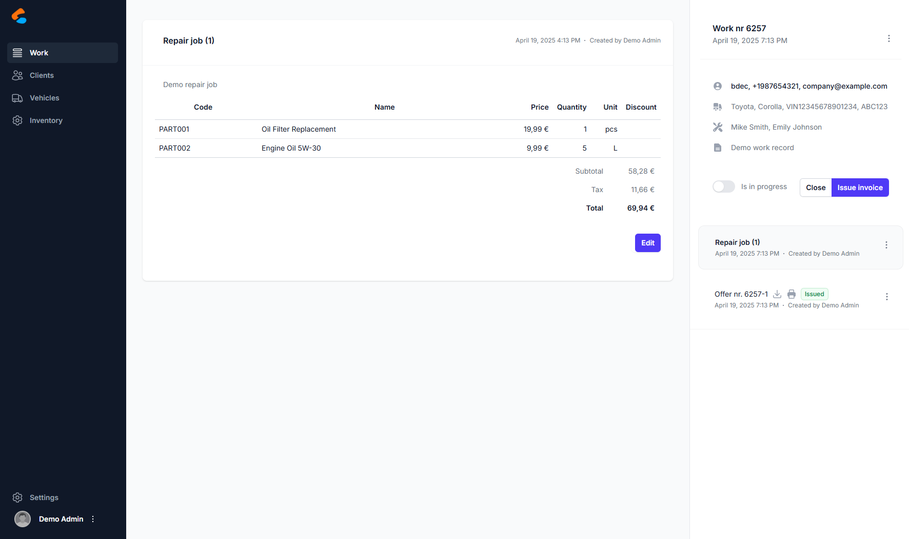
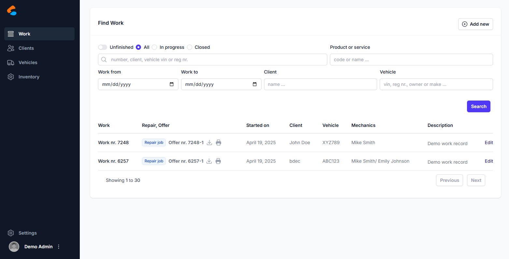

# CarCare

**CarCare** is a modern, self-hosted workshop management system built for vehicle service centers, auto repair shops, and maintenance facilities. It helps streamline your operations from job tracking to invoicing — all in one intuitive interface.



## ✨ Features

- 📋 Work order management with parts and labor tracking
- 🚗 Vehicle and client profiles with full history
- 📎 Offer and invoice generation with PDF export
- 🧰 Inventory and spare part control
- 📩 Email integration for quotes/invoices
- 🤪 CI/CD ready (Github Actions, Docker-based)
- 🌐 Clean modern UI (Next.js + Tailwind)

## 🌍 Live Demo

You can try the full-featured hosted version here:

️ [https://carcareco.app](https://carcareco.app)

Click **"Try the demo"** on the landing page and enter a company name to spin up your own sandbox environment.

> Each demo company gets a private tenant database — feel free to explore!

## 🚀 Getting Started (Local Docker)

```bash
git clone https://github.com/your-org/carcare.git
cd carcare

# Generate random secrets and config (on windows)
powershell -ExecutionPolicy Bypass -File scripts/setup-secrets.ps1
# Generate random secrets and config (on linux)
chmod +x scripts/setup-secrets.sh
./scripts/setup-secrets.sh

# edit secrets if you need to
# backend/src/Carmasters.Http.Api/appsettings.Secrets.json
# frontend/.env

# Start services
docker compose up --build -d
```

### Access
- UI: [http://localhost:3000](http://localhost:3000)
- API: [http://localhost:15567/swagger](http://localhost:15567/swagger)
- Mail preview: [http://localhost:8025](http://localhost:8025)

### 🔐 Default Login
When running CarCare locally using Docker, a default user is created for convenience:

```txt
Username: admin  
Password: carcare
```

## 📸 Screenshots

| Work List | Work Details | Invoice PDF |
|----------|------------|-------------|
|  |  |  |

## 🛠 Tech Stack

- **Frontend:** Next.js 15, Tailwind CSS, Headless UI
- **Backend:** ASP.NET Core (.NET 9), NHibernate ORM
- **Database:** PostgreSQL with multitenancy support
- **CI/CD:** Github Actions, Docker Compose

## 📄 License

[GNU AGPL v3.0](LICENSE)

---

## 🤝 Contributing (coming soon)

Want to help? Contributions, ideas, and feedback welcome!  
I am working on a CONTRIBUTING.md and roadmap.

